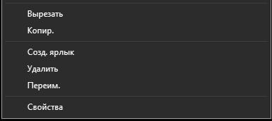
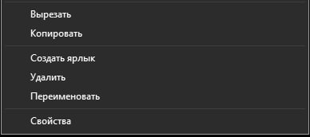

# Context Menu Text Replacer
## Before



## After



A Windhawk mod that replaces shortened labels in the classic Windows context menu.

Current replacements:
```
Переим.     -> Переименовать
Созд. ярлык -> Создать ярлык
Копир.      -> Копировать
```
Tested on Windows 11 25H2.
